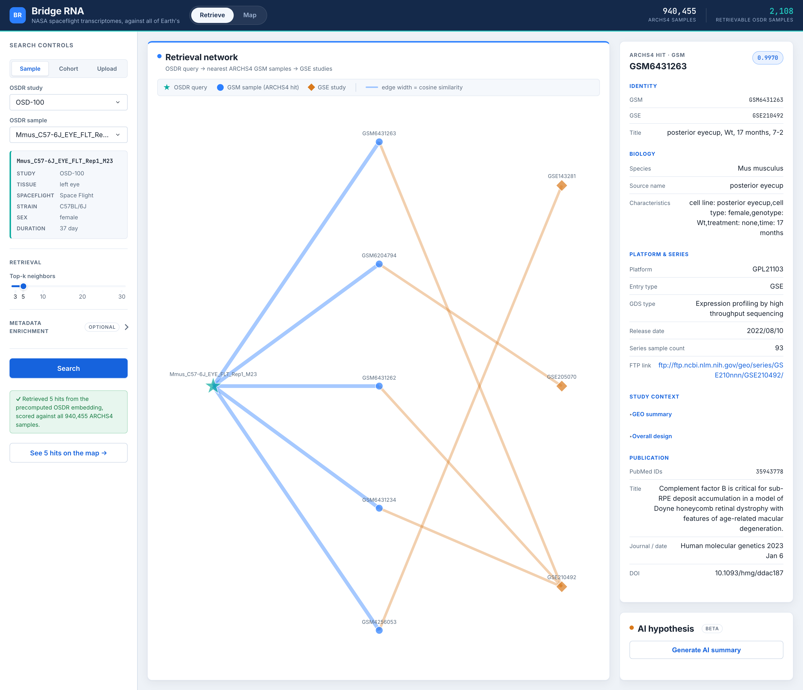
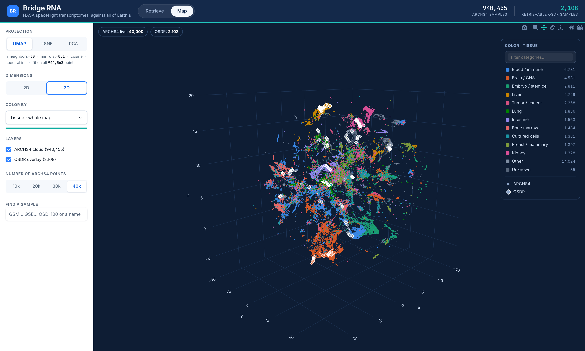

# Bridge RNA

**Bridge RNA takes one RNA-seq sample flown on a NASA mission and finds the Earth studies that look most like it**, out of a collection of 940,455 samples.

Developed by the **Space Biosciences Research Branch at NASA Ames Research Center**.

## The two views

Bridge RNA is one app with two pages.

### Retrieve (`/`)

Pick a sample from NASA's Open Science Data Repository (OSDR).
Bridge RNA returns its nearest Earth neighbours, drawn as a network of matches and the studies they came from, with an inspector and an optional AI summary.



The screenshot above is a real retrieval.
The query is a mouse left-eye sample, and the studies it pulls back are all mouse retina studies.
Nothing in the pipeline was told the query was an eye; it found the retina on its own, from expression alone.

### Map (`/map`)

The same space, seen all at once.
Both collections - 2,108 NASA samples and 940,455 Earth samples - are placed in one shared projection and drawn as live points, colored by tissue.
You can rotate it, switch between 2-D and 3-D, recolor it, and overlay a retrieval to see where a query and its matches sit.



## How it works

Both views run on one idea.
A trained neural network reads a sample's whole transcriptome and turns it into a single point in a 512-dimensional space, placed so that samples with similar expression land near each other.
Retrieval searches that space for one query; the map draws all of it.

### The model and the shared space

The network is an `ExpressionPerformer`, a transformer whose tokens are genes and whose values are expression levels.
It reads 15,165 genes in a fixed canonical order and produces 512 numbers per sample by averaging its per-gene internal states.
Two samples are compared by the cosine between their vectors, and that one number is the only measure of similarity anywhere in the app.

Both collections pass through identical preprocessing before the model sees them.
Mouse genes are mapped to their human orthologs, counts are TPM-normalised and log-scaled, and the genes are put in one canonical order.
A SHA-256 digest of that order is checked on every build, and the build aborts if it does not match, because a gene list in the wrong order pairs each gene's learned identity with another gene's expression value and produces results that look fine and mean nothing.

### Retrieving Earth analogs

A query is one OSDR sample.
The app embeds it, or looks up its precomputed vector, then scans all 940,455 Earth vectors once and keeps the closest by cosine.
There is no approximate index; the scan is exact.
It takes about half a second when the vector is already cached, and about 22 seconds when the sample has to be embedded from its raw counts, and the status line always says which path ran.

Every Earth hit's row in the embedding index is also its point on the map, and every OSDR sample is keyed by the same `accession|sample name` string in both halves.
That shared key is why a retrieval you run on one page can be redrawn in place on the other, with no lookup table between them.

### Querying with a whole experimental group

A spaceflight study does not have one sample, it has a group, and one sample is not a stable question to ask.
Two mice from the same cage, the same tissue and the same flight condition share only **16%** of their five nearest Earth analogs, and often none at all.
That is not a defect in either query: the entire top-500 of a 940,455-sample index spans a range of similarity comparable to the gap between two animals in the same cage, so the ordering of the list is decided below the noise floor of the biology.

**Cohort** mode asks the question the study is actually powered to answer.
It groups the samples the way OSDR already curates them, by study, tissue and flight condition, averages the group's embeddings into one query, and searches with that.
Measured over all 212 cohorts in the corpus, this raises the agreement of the result list from 0.16 to **0.74**, a 4.6-fold gain, and it still reads the index only once however large the group is.

You can widen what counts as one cohort by dropping tissue or condition, which merges a study's organs or its arms into one larger group.
Study is always part of the definition and cannot be removed, because samples from one study resemble each other for reasons that include how they were processed, and pooling across studies would average across that.
Splitting finer than this is deliberately not offered: every further split makes the cohort smaller, and the gain above rises steeply with group size.

**Once the search has run, the app tells you how far to trust that particular result, by measuring it.**
It re-runs the same query with each animal left out in turn and reports how much of the list survives, alongside what one of those animals alone would have agreed with another, at whatever depth you are reading.
That replaced a figure looked up from a curve of cohort size, which was a corpus-wide average being shown against one cohort's name: it told every group of five to nine animals 0.72, while real ones in that range measure anywhere from 0.32 to 0.85.
A result that moves when one animal is dropped is flagged in amber, every member is listed with how far it sits from the rest, and you can exclude one and search again.
An optional comparison runs a second cohort as its own separate query, so you can ask how much of the Earth that a study's flight animals resemble is also resembled by its ground controls.
It is deliberately not a flight-minus-ground difference vector: a difference of two directions is not a transcriptome, and an earlier attempt at exactly that turned out to be measuring something else entirely.

Both cohorts are drawn on the map, which is where that comparison is actually settled.
The overlap the panel reports is a number about two *sets* of hits, and two arms can share no hits at all while sitting in the same neighbourhood, each picking different samples out of the same crowd.
Each cohort's pooled animals are drawn in its own color, its hits in its own ring shape, and a sample both cohorts retrieved carries both rings.
You can untick either arm when the picture gets crowded.

Full method and every measurement: [`docs/cohort_retrieval.md`](docs/cohort_retrieval.md), and [`docs/live_stability.md`](docs/live_stability.md) for how the trust number is measured.

### The map

The map is the same space projected down to two and three dimensions.
Three reductions are offered.
PCA is fast and linear, and honest about global magnitude structure.
UMAP is nonlinear and keeps local neighbourhoods.
t-SNE is also nonlinear, separates local structure harder still, and is the slowest to build by a wide margin.
All three are fit once, offline, on every one of the 942,563 points rather than on a subsample, and the app only ever loads the finished coordinates.
Fitting the two neighbour embeddings over the whole corpus is a job measured in tens of minutes and gigabytes of memory, which is the reason neither happens inside the running app.

The control rail states the parameters each one was actually fit with, read back from the build record rather than from constants written into the app.
That readout is dimension-aware because the fit genuinely is: t-SNE's interpolation accelerator refuses more than two output dimensions, so the 3-D map is a Barnes-Hut layout and the 2-D one is not.

Two cautions specific to t-SNE, both measured on this corpus rather than inherited from folklore.
It fills the plane as a disc, so whitespace between clusters carries no meaning, where UMAP's islands at least suggest separation.
And it separates the two corpora more than UMAP does, which makes it the worst of the three for eyeballing whether OSDR and ARCHS4 overlap.

Vectors are L2-normalised before any reduction.
Without that step the first principal component is really a magnitude axis and holds 57.8% of the variance, swamping the rest; normalised, it drops to 41.3% and the biology comes through.

### Coloring both collections by tissue

OSDR and ARCHS4 describe tissue in completely different ways.
OSDR is curated but hyper-specific ("Right extensor digitorum longus", 48 values in all).
ARCHS4 has no tissue column at all, only 42,754 distinct free-text GEO strings.
`manifold/tissue.py` folds both onto one list of 37 anatomical buckets plus "Other" and "Unknown", using ordered keyword rules where the first match wins.
The order is what keeps "bone marrow" from being read as "bone" and "adrenal" from being read as "renal".
Because both collections go through the same function, a liver in GEO and a NASA liver get the same color and the same legend row.
All 48 OSDR values and 90.6% of the Earth samples land in a named bucket.

The map will not paint a collection it cannot describe as though it were data.
Pick an OSDR-only field like Flight vs Ground and the 940,455 Earth points have no value for it, so rather than a flat grey cloud that reads as "measured and empty", they are drawn as faint context with no legend entry.
The color-by menu says up front what each field covers, and a field whose data has not been built is shown disabled with the command that builds it.

### Hovering and inspecting

On the map, hovering an OSDR point shows its name and what it is under the current coloring.
The Earth cloud carries no hover data on purpose, both for speed at a million points and because a click that returns nothing is how the app knows you clicked the background rather than a sample.
In the retrieval view, the network graph draws the query, each matched sample, and the studies they belong to; clicking any node opens its full metadata in the inspector and fetches the study abstract from NCBI on demand.

### The AI reading

The AI summary is a reading aid, not part of the retrieval.
When you ask for it, the app builds a prompt from your query's metadata, the table of hits, and the studies' abstracts, and sends it to a language model.
By default that model is a local Ollama server, so nothing leaves your machine; an AWS Bedrock endpoint is the alternative and does send the prompt to a remote service.
The model only ever sees the metadata and abstracts, never the expression values, so read what it writes as a starting point to check against the linked records, not as a result.

### What the results mean, and what they do not

A retrieval is a statement about whole-transcriptome similarity as this one model encodes it: these are the Earth samples whose expression looks most like your NASA sample's.
It is a good way to find candidate reference studies and to form a hypothesis worth testing.
It is not a differential-expression result and not a causal claim.
Similarity in bulk RNA-seq is dominated by tissue and cell composition, so a top hit often confirms which tissue you are looking at more than any spaceflight signature, and the scores usually sit in a narrow band, so read the top hits as a set rather than a ranked podium.

On the map, read neighbourhoods, not exact distances.
UMAP keeps track of which points are close but deliberately does not preserve how far apart distant points are.
That is why no line is drawn between a query and its matches, and why each hit's hover shows both its rank by true 512-dimensional similarity and its rank by position on screen, which often disagree.

## Quickstart

You need **Python 3.11** (64-bit), **Git**, and **Git LFS**.
The model and index (~2 GB) are stored in Git LFS; everything else arrives with a normal clone.

**1. Clone and fetch the large files**

```bash
git lfs install
git clone https://github.com/de-jish/bridge-rna.git
cd bridge-rna
git lfs pull
python3 fetch_artifacts.py --verify-only   # checks the large files arrived intact
```

**2. Install dependencies**

```bash
python3.11 -m venv .venv
.venv/bin/python -m pip install --upgrade pip
.venv/bin/python -m pip install -r requirements.txt
```

On Windows, use `py -3.11 -m venv .venv` and `.\.venv\Scripts\python.exe` in place of `.venv/bin/python`.
The first install is large because it includes PyTorch and PyArrow.

**3. Run the app**

```bash
.venv/bin/python app.py
```

Open <http://localhost:8050> and stop with `Ctrl+C`.
`/` is retrieval, `/map` is the map.
If something is missing, the app still starts and shows a banner naming exactly what is wrong and how to fix it.

By default the app is reachable only from your own machine.
Use `--port`, `--debug`, or `--host 0.0.0.0` to change that.
This is a development server, so put a real WSGI server in front of it for anything beyond local use.

## AI readings (optional)

The AI summary uses a local [Ollama](https://ollama.com) server, which needs no account or API key.

```bash
brew install ollama
brew services start ollama
ollama pull gemma3:4b
```

The app finds it automatically.
Set `OLLAMA_MODEL` for a different model or `OLLAMA_BASE_URL` for a remote server.
Without Ollama, everything else still works and the panel tells you what to install.
Other optional settings (NCBI enrichment, an AWS Bedrock backend) are in `.env.example`.

## Building the map (optional)

The map is drawn from precomputed coordinates, so it needs a one-time build.
Retrieval works without it; only `/map` depends on it.
Run the steps in order, because the metadata fetch joins onto the table the projection build writes.

```bash
PY=.venv/bin/python
$PY precompute/embed_osdr.py                              # NASA embeddings. Hours; resumable.
$PY precompute/build_projections.py                      # full-corpus projections. Hours, mostly 3-D t-SNE.
$PY precompute/fetch_archs4_meta.py                      # Earth metadata. ~35 s, needs network.
$PY precompute/validate_artifacts.py --mixing --quality  # gates the build
```

`embed_osdr.py` records its progress and resumes where it stopped, so an interrupted run does not start over.

The projection build is dominated by one stage. PCA takes seconds and UMAP about fourteen minutes, but 3-D t-SNE takes hours on its own, because the fast interpolation method only works for two output dimensions and three dimensions falls back to a much slower algorithm.
`--skip-tsne` leaves it out and is not a broken build: the t-SNE option is shown disabled, the validator reports it as skipped rather than failing, and everything else works.
Each projection is a separate stage, so you can rebuild one without redoing the others.
The validator is the check a structural pass cannot give you: row counts and finite coordinates are satisfied by any set of numbers, so `--quality` scores each projection on how well it preserves the 512-dimensional space it came from, against a null that says what the number would be if the map carried no information.

To try the map before building the real cache, which takes hours, build a synthetic corpus of the same shape and point the app at it:

```bash
$PY tests/build_dev_corpus.py --out /tmp/bm-dev --archs4 60000 --osdr 2000 --clean
BRIDGE_RNA_ROOT=/tmp/bm-dev/bridge_rna MANIFOLD_CACHE_DIR=/tmp/bm-dev/cache $PY app.py
```

The numbers are meaningless biologically; the corpus exists to exercise the interface, not to be read.

## Known limitations

- 788 of the listed NASA samples cannot be retrieved (no spaceflight condition recorded, or the name matches no column in their counts matrix). They are disabled in the picker with the reason rather than hidden.
- The two collections were embedded on different hardware and in different precisions, which leaves a technical signature in the shared space: NASA samples that share neither study nor tissue still neighbour each other far above chance. Compare within a collection rather than across it.
- The AI reading is generated by a small local model and is a starting point for interpretation, not a result.

## Tests

```bash
.venv/bin/python -m pytest tests/ -q             # 330 tests, about twenty-five seconds
.venv/bin/python tests/e2e_check.py              # 50 browser checks; needs the built cache
.venv/bin/python tests/e2e_upload_check.py       # 70 checks of the upload path
.venv/bin/python tests/e2e_cohort_check.py       # 146 checks of cohort retrieval
```

The pytest suite builds its own synthetic corpus in a temp directory and never touches the model checkpoint or the 963 MB memmap, so it runs on a machine that has neither.
The three browser suites boot the real app against the real `cache/` and assert on what the page reports about itself, down to each budget tier drawing exactly the point count it advertises.

Two scripts check the science rather than the software, against the real corpus:

```bash
.venv/bin/python precompute/validate_artifacts.py --mixing --quality
.venv/bin/python precompute/validate_cohorts.py   # 6 checks over all 212 cohorts
```

`validate_cohorts.py` is the honesty gate behind Cohort mode.
It measures how much a pooled result survives dropping one animal, and holds that against two nulls: a pooled query over random samples, and a pooled query over random samples from the same study.
The second one is the demanding test, and its result is reported in the docs rather than buried: most of what makes a cohort coherent is the study it came from, so a pooled query is a cleaner measurement of one study's samples than of the biology in general.

## Project layout

| Path | What it is |
| --- | --- |
| `app.py` | The single entry point: header, router, both views. |
| `bridge_rna/` | The retrieval half. |
| `manifold/` | The map half. |
| `precompute/` | Offline jobs that build the map cache, plus the validator. |
| `data/` | NASA counts, sample metadata, orthologs, and gene annotations. |
| `checkpoints_performer/` | Trained model checkpoint (Git LFS). |
| `archs4_sample_embeddings_full/` | Precomputed Earth embedding index (Git LFS). |
| `cache/` | The map's precomputed artifacts (built locally). |

For the design and the verified facts in depth, see [`IMPLEMENTATION.md`](IMPLEMENTATION.md) and [`REFERENCE.md`](REFERENCE.md).

## Licensing

The **code** is released under the [MIT License](LICENSE).

The **bundled data is not** and carries its own terms.
Spaceflight data is from NASA's [Open Science Data Repository](https://osdr.nasa.gov/), the Earth corpus is [ARCHS4](https://maayanlab.cloud/archs4/) from the Ma'ayan Lab, and gene annotations come from [Ensembl](https://www.ensembl.org/) and [GENCODE](https://www.gencodegenes.org/).
Review each source's terms before redistributing.

## Citing

If you use Bridge RNA in published work, see [`CITATION.cff`](CITATION.cff).

Bridge RNA was developed by the Space Biosciences Research Branch at NASA Ames Research Center, which studies how living systems respond to the space environment.
